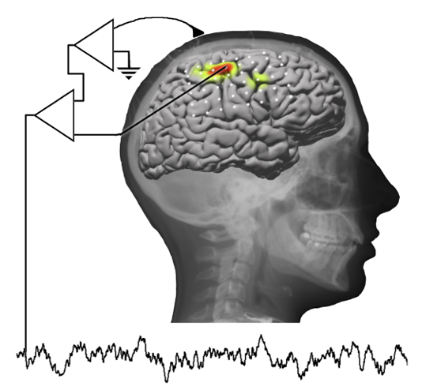
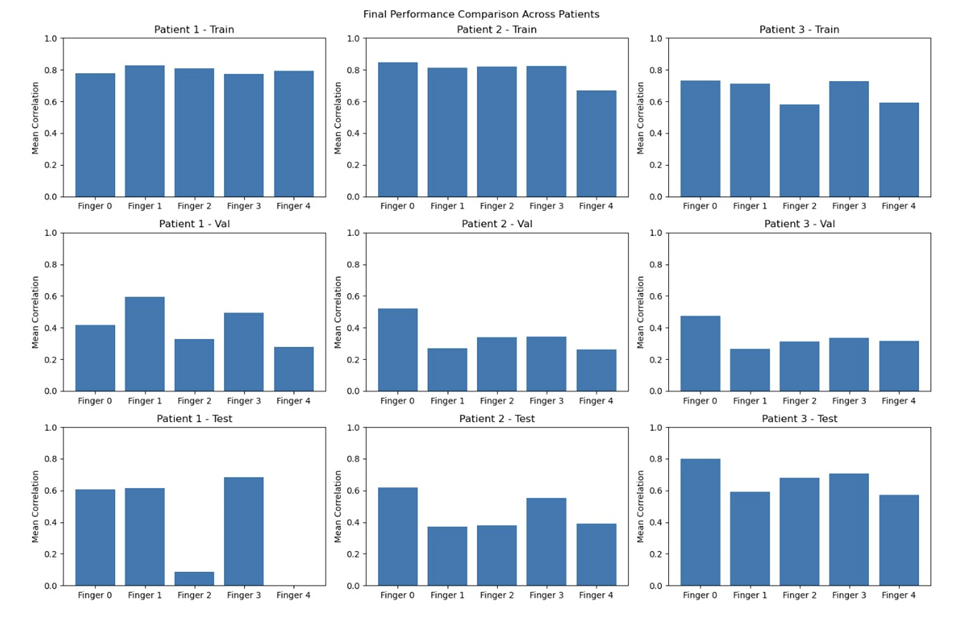
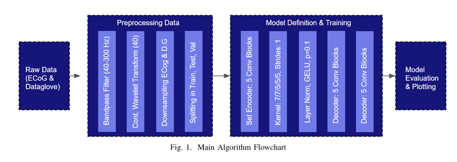
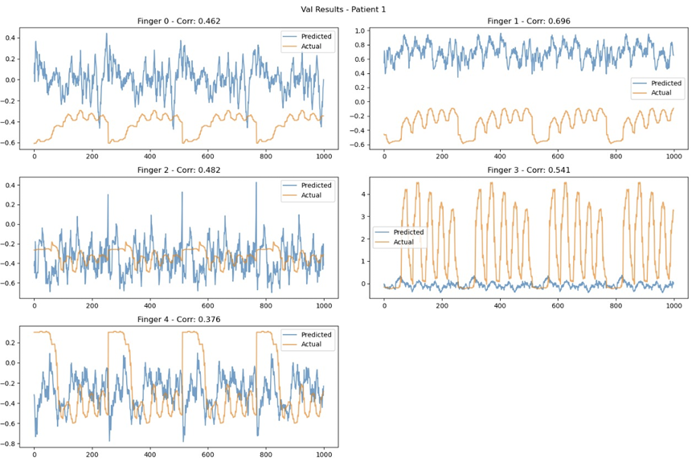
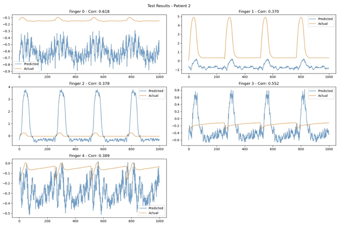
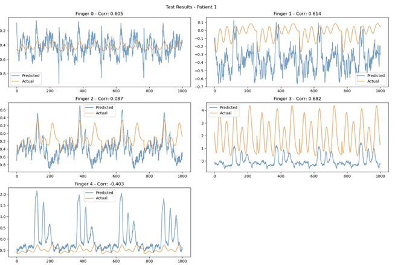
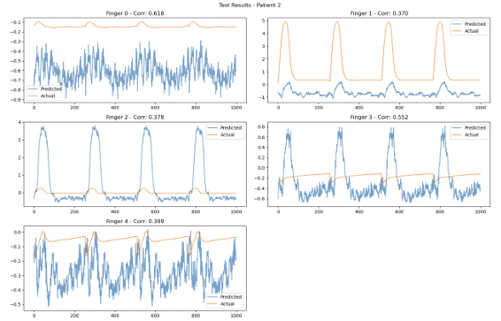
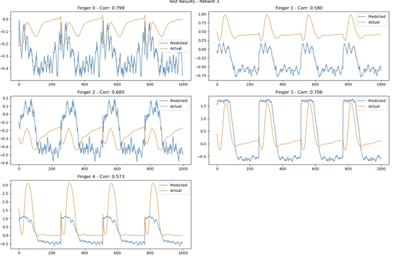

# 🧠 ECoG-Based_Regression_for_Multi-Finger_Flexion_Decoding

> **Description**: I worked to develop a deep learning pipeline that decodes individual finger movements from electrocorticography (ECoG) signals recorded from the surface of the brain. Our system employs a 1D convolutional autoencoder with U-Net-style skip connections, wavelet-initialized filters, a bidirectional LSTM temporal module, and dilated convolutions to map continuous wavelet transform spectrograms to finger flexion trajectories — achieving an average Pearson correlation of 0.5455 across three subjects and surpassing both competition checkpoints (r ≥ 0.33 and r ≥ 0.45).

[](https://github.com)
[](https://github.com)
[](https://github.com)
[](https://github.com)
[](https://www.python.org/)
[](https://pytorch.org/)

<div align="center">

**Full Decoding Pipeline:**
Raw ECoG → Bandpass Filter → CWT Spectrograms → 1D Conv Autoencoder + BiLSTM → Finger Flexion Predictions

</div>

<div align="center">

<p float="left">

  
</p>

</div>

---

## 📋 Table of Contents

- [Overview](#-overview)
- [Key Features](#-key-features)
- [System Architecture](#-system-architecture)
- [Technical Approach](#-technical-approach)
  - [1. Signal Preprocessing](#1-signal-preprocessing)
  - [2. Time-Frequency Decomposition (CWT)](#2-time-frequency-decomposition-cwt)
  - [3. Autoencoder Architecture](#3-autoencoder-architecture)
  - [4. Temporal Modeling (BiLSTM)](#4-temporal-modeling-bilstm)
  - [5. Training & Optimization](#5-training--optimization)
- [Performance Results](#-performance-results)
- [Key Algorithms](#-key-algorithms)
  - [1. Continuous Wavelet Transform](#1-continuous-wavelet-transform)
  - [2. Wavelet-Initialized Convolutions](#2-wavelet-initialized-convolutions)
  - [3. U-Net Skip Connections with Dilation](#3-u-net-skip-connections-with-dilation)
  - [4. Pearson Correlation Metric](#4-pearson-correlation-metric)
- [What Did Not Work](#-what-did-not-work)
- [Neuroanatomy: Why the Ring Finger Was Excluded](#-neuroanatomy-why-the-ring-finger-was-excluded)
- [Lessons Learned](#-lessons-learned)
- [Future Improvements](#-future-improvements)
- [References](#-references)
- [Acknowledgments](#-acknowledgments)

---

## 🎯 Overview

Our project tackles the 4th Brain-Computer Interface Data Competition: predicting continuous finger flexion trajectories from ECoG recordings captured on the cortical surface of three epileptic patients. Each patient wore a subdural electrode grid (48–64 channels, sampled at 1000 Hz) while responding to visual cues to flex individual fingers. A data glove simultaneously recorded the resulting flexion of five fingers.

The core challenge is mapping high-dimensional, noisy neural signals — which carry motor intention before movement actually occurs — to smooth, continuous flexion waveforms. A characteristic neurophysiological delay separates brain activity from physical movement; our pipeline explicitly compensates for this. The final model is an end-to-end 1D convolutional autoencoder augmented with wavelet-based weight initialisation, increasing dilation rates for long-range temporal context, and a bidirectional LSTM layer for sequence-level refinement. It is trained independently per patient to handle the varying electrode counts and individual neural signatures.

---

**Course**: BE 521 — Brain-Computer Interfaces  
**Institution**: University of Pennsylvania  
**Semester**: Spring 2025    
**Dataset**: 4th BCI Data Competition (Harborview Hospital, Seattle)  

---

## ✨ Key Features

### 🔧 Core Capabilities

- ✅ **4th-Order Butterworth Bandpass Filter** isolating motor-relevant frequency bands
- ✅ **Continuous Wavelet Transform (CWT)** using Complex Morlet wavelets across 40 scales
- ✅ **Neurophysiological Delay Compensation** — 187 ms forward shift of flexion targets
- ✅ **Wavelet-Initialized Conv1D Layers** using Biorthogonal 6.8 decomposition filters
- ✅ **Dilated Convolution Encoder** with rates [1, 2, 4, 8, 1] for expanding receptive field
- ✅ **U-Net Skip Connections** preserving fine-grained temporal detail through the bottleneck
- ✅ **Bidirectional LSTM** for global temporal sequence refinement
- ✅ **ReduceLROnPlateau Scheduler** with adaptive learning rate decay
- ✅ **Per-Patient Independent Models** handling 62 / 48 / 64 electrode configurations
- ✅ **Surpassed Both Checkpoints** — r ≥ 0.33 and r ≥ 0.45 on the leaderboard test set

### 🎓 Advanced Techniques

- Spatial Conv2D mixing across electrode channels before temporal flattening
- Dirac-initialised spatial convolution for identity-preserving first pass
- Layer normalisation (not batch norm) for stable training on variable-length ECoG windows
- GELU activations throughout the encoder-decoder for smooth gradient flow
- Early stopping with patience = 5 and Δ = 0.001 on validation correlation
- Top-2 model checkpointing keyed on best validation correlation

---

## 🏗️ System Architecture

```
┌───────────────────────────────────────────────────────────────────┐
│                     DECODING PIPELINE                             │
│                                                                   │
│   ┌──────────┐   ┌──────────┐   ┌──────────┐   ┌──────────────┐   │
│   │  RAW     │   │BANDPASS  │   │   CWT    │   │  SPATIAL     │   │
│   │  ECoG    │──▶│  FILTER  │──▶│SPECTROGRAM│──▶│  CONV 2D  │   │
│   │ 1000 Hz  │   │ 4th-ord  │   │ 40 scales│   │ (ch mixing)  │   │
│   └──────────┘   └──────────┘   └──────────┘   └──────┬───────┘   │
│                                                        │          │
│                                                        ▼          │
│   ┌──────────────────────────────────────────────────────────┐    │
│   │                 1D CONVOLUTIONAL AUTOENCODER              │   │
│   │                                                          │    │
│   │   ┌─────────┐  ┌─────────┐  ┌─────────┐  ┌──────────┐  │      │
│   │   │SPATIAL  │  │ENCODER  │  │ENCODER  │  │ ENCODER  │  │      │
│   │   │REDUCE   │─▶│ Block 1 │─▶│ Block 2 │─▶│ Block 3  │─▶│    │
│   │   │32 ch    │  │32→32    │  │32→64    │  │ 64→64    │  │      │
│   │   └─────────┘  │dil=1    │  │dil=2    │  │ dil=4    │  │      │
│   │       ↕skip    └─────────┘  └─────────┘  └──────────┘  │      │
│   │                     ↕skip       ↕skip         ↕skip     │     │
│   │   ┌─────────┐  ┌─────────┐  ┌─────────┐  ┌──────────┐  │      │
│   │   │OUTPUT   │◀─│DECODER  │◀─│DECODER  │◀─│ DECODER  │◀─│    │
│   │   │1×1 conv │  │ Block 1 │  │ Block 2 │  │ Block 3  │  │      │
│   │   │→5 fingers│  │32←64    │  │64←128   │  │ 64←128   │  │     │
│   │   └─────────┘  └─────────┘  └─────────┘  └──────────┘  │      │
│   └──────────────────────────────────────────────────────────┘    │
│                              │                                    │
│                              ▼                                    │
│   ┌──────────────────────────────────────┐                        │
│   │         BIDIRECTIONAL LSTM           │                        │
│   │   input: 64 ch  →  hidden: 64 × 2   │                         │
│   │   output: 128 features per timestep  │                        │
│   └──────────────┬───────────────────────┘                        │
│                  │                                                │
│                  ▼                                                │
│   ┌──────────────────────┐                                        │
│   │   FINGER FLEXION     │                                        │
│   │   PREDICTIONS        │                                        │
│   │   5 × T output       │                                        │
│   └──────────────────────┘                                        │
└───────────────────────────────────────────────────────────────────┘
```

### Module-Level Data Flow

```
                  ┌────────────────────────┐
                  │  raw_training_data.mat │
                  │  train_ecog / train_dg │
                  └────────┬───────────────┘
                           │  (time × channels) @ 1000 Hz
                           ▼
                  ┌────────────────────────┐
                  │  preprocess_ecog()     │
                  │  butter → CWT → dec.   │
                  └────────┬───────────────┘
                           │  (channels × 40 × T/10)  float32 .npy
                           ▼
                  ┌────────────────────────┐
                  │  preprocess_fingerflex()│
                  │  decimate + delay shift │
                  └────────┬───────────────┘
                           │  (5 × T/10) aligned targets
                           ▼
                  ┌────────────────────────┐
                  │  EcogFingerflexDataset │
                  │  sliding window 256 s  │
                  └────────┬───────────────┘
                           │  batches of (B, ch, 40, 256)
                           ▼
                  ┌────────────────────────┐
                  │  AutoEncoder1D         │
                  │  + spatial_conv        │
                  │  + encoder / decoder   │
                  │  + BiLSTM              │
                  │  + conv1x1 output      │
                  └────────┬───────────────┘
                           │  (B, 5, 256) predictions
                           ▼
                  ┌────────────────────────┐
                  │  MSE Loss + Adam       │
                  │  ReduceLROnPlateau     │
                  │  EarlyStopping         │
                  └────────────────────────┘
```

---

## 🔬 Technical Approach

<div align="center">

<p float="left">

</p>

</div>

### 1. Signal Preprocessing

#### Bandpass Filtering

Raw ECoG arrives at 1000 Hz across 48–64 channels. A 4th-order Butterworth filter implemented via second-order sections (SOS) removes out-of-band noise while preserving motor-relevant activity. Zero-phase filtering (`sosfiltfilt`) avoids any group-delay distortion.

```python
# BCI_Final.py — filtering stage
L_FREQ, H_FREQ = 5, 200   # Hz — final tuned bounds

sos = scipy.signal.butter(4, [L_FREQ, H_FREQ],
                          btype='band', fs=1000, output='sos')
ecog_filtered = scipy.signal.sosfiltfilt(sos, ecog_data, axis=0)
```

> **Note:** The report bandpass is listed as 40–300 Hz; the final submitted code uses 5–200 Hz after iterative experimentation showed that narrower high-pass cutoffs retained low-gamma content with predictive value, while the original 300 Hz upper bound exceeded the Nyquist-safe range for the decimation step.

#### Neurophysiological Delay Compensation

Brain activity precedes physical movement by a characteristic latency. The flexion target is shifted forward in time (and zero-padded at the tail) so that the model learns to map neural patterns to the movement they actually cause.

```python
# BCI_Final.py — delay alignment
time_delay_secs = 0.187                          # seconds
delay_samples   = int(time_delay_secs * 100)     # 19 samples @ 100 Hz

dg_proc = np.roll(dg_proc, shift=-delay_samples, axis=0)
dg_proc[-delay_samples:, :] = 0                  # zero-pad the end
```

#### Downsampling

After CWT, temporal resolution is reduced 10× (1000 Hz → 100 Hz) via `scipy.signal.decimate` to cut memory and training time while preserving spectral detail already captured by the wavelets.

### 2. Time-Frequency Decomposition (CWT)

The Complex Morlet wavelet (`cmor1.5-1.0`) decomposes each electrode channel into a 40-scale spectrogram spanning the filter band. This converts the 1D time series per channel into a 2D time-frequency image, giving the autoencoder a rich input representation.

```python
# BCI_Final.py — CWT
scales = pywt.scale2frequency('cmor1.5-1.0',
                              np.arange(1, 41)) * 1000   # original_fs
scales = scales[(scales >= L_FREQ) & (scales <= H_FREQ)]

ecog_wavelet = np.zeros((n_channels, 40, n_time))
for ch in range(n_channels):
    coef, _ = pywt.cwt(ecog_filtered[:, ch], scales,
                       'cmor1.5-1.0', sampling_period=1/1000)
    ecog_wavelet[ch, :coef.shape[0], :] = np.abs(coef)
```

**Output tensor shape per patient:**

| Patient | Electrodes | Wavelet Scales | Time (@ 100 Hz) | Tensor Shape          |
|---------|------------|----------------|------------------|-----------------------|
| 1       | 62         | 40             | ~60,000          | (62, 40, ~60000)      |
| 2       | 48         | 40             | ~60,000          | (48, 40, ~60000)      |
| 3       | 64         | 40             | ~60,000          | (64, 40, ~60000)      |

### 3. Autoencoder Architecture

The AutoEncoder1D is a U-Net-style encoder-decoder that maps the spectrogram input to five simultaneous flexion output channels.

#### Spatial Convolution (Pre-Encoder)

A 1×1 Conv2D mixes information across electrode channels before the temporal pipeline begins. It is Dirac-initialised so the first forward pass is an identity — the network learns cross-channel correlations gradually.

```python
# BCI_Final.py — spatial mixing
self.spatial_conv = nn.Conv2d(n_electrodes, n_electrodes,
                              kernel_size=(1, 1), padding='same')
nn.init.dirac_(self.spatial_conv.weight)   # identity init
```

#### Spatial Reduction

A single ConvBlock collapses the (channels × 40) spectrogram dimension into a compact 32-channel 1D representation:

```python
# input:  (batch, electrodes × 40, time)
# output: (batch, 32, time)
self.spatial_reduce = ConvBlock(n_electrodes * 40, 32, kernel_size=3)
```

#### Encoder Blocks

Five convolutional blocks progressively halve the temporal dimension while widening the channel count. Dilation rates [1, 2, 4, 8, 1] expand the effective receptive field without pooling, capturing both local and long-range dependencies.

| Block | In Ch | Out Ch | Kernel | Stride | Dilation | Receptive Field Contribution |
|-------|-------|--------|--------|--------|----------|------------------------------|
| 1     | 32    | 32     | 7      | 2      | 1        | 7 samples                    |
| 2     | 32    | 64     | 7      | 2      | 2        | 13 samples                   |
| 3     | 64    | 64     | 5      | 2      | 4        | 17 samples                   |
| 4     | 64    | 128    | 5      | 2      | 8        | 33 samples                   |
| 5     | 128   | 128    | 5      | 2      | 1        | 5 samples                    |

Each block applies:
```
Conv1D (wavelet-init) → LayerNorm → GELU → Dropout(0.1) → MaxPool1D(stride=2)
```

#### Decoder Blocks + Skip Connections

Five UpConvBlocks mirror the encoder. Each block first applies a ConvBlock, then upsamples via linear interpolation. The output is **concatenated** with the corresponding encoder skip connection, doubling the channel count before the next stage.

```python
# Decoder forward pass (pseudocode)
for i in range(model_depth):
    x = upsample_blocks[i](x)                          # conv + upsample
    x = torch.cat((x, skip_connection[-1 - i]), dim=1) # concatenate skip
```

#### Output Layer

A 1×1 convolution projects the 128-channel (64 decoder + 64 skip) feature map to 5 output channels — one per finger — while preserving the full temporal resolution.

```python
self.conv1x1_one = nn.Conv1d(128, 5, kernel_size=1, padding='same')
```

### 4. Temporal Modeling (BiLSTM)

After the decoder reconstructs full temporal resolution, a bidirectional LSTM sweeps forward and backward across time, refining predictions with global sequence context that the convolutional layers cannot capture.

```python
# BCI_Final.py — BiLSTM stage
self.lstm = nn.LSTM(input_size=64,       # channels[0] * 2 after skip cat
                    hidden_size=64,
                    batch_first=True,
                    bidirectional=True)   # output: 128 features

# In forward():
x = x.permute(0, 2, 1)          # (batch, time, 64)
x, _ = self.lstm(x)             # (batch, time, 128)
x = x.permute(0, 2, 1)          # (batch, 128, time)
x = self.conv1x1_one(x)         # (batch, 5, time)
```

### 5. Training & Optimization

#### Data Splitting & Windowing

Each patient's preprocessed data is split chronologically (no shuffling across the split boundary to avoid data leakage):

| Split      | Fraction | Purpose                        |
|------------|----------|--------------------------------|
| Train      | 70 %     | Model parameter updates        |
| Validation | 15 %     | Hyperparameter selection       |
| Test       | 15 %     | Final held-out evaluation      |

A sliding window of **256 samples** (2.56 s at 100 Hz) with **stride 1** is applied, generating dense training examples:

```python
# EcogFingerflexDataset
self.sample_len = 256
self.stride    = 1
self.ds_len    = (duration - 256) // 1   # one sample per timestep shift
```

#### Loss & Optimizer

```python
# Loss
loss = F.mse_loss(y_hat, y)          # pixel-wise MSE over all 5 fingers × 256 time steps

# Optimizer
optimizer = Adam(lr=8.42e-5, weight_decay=1e-6)

# Scheduler — halves LR when val_corr plateaus for 2 epochs
scheduler = ReduceLROnPlateau(optimizer, mode='max', factor=0.5, patience=2)
```

#### Regularisation

| Technique            | Setting                                          |
|----------------------|--------------------------------------------------|
| Dropout              | p = 0.1 in every ConvBlock                       |
| Weight decay         | 1e-6 (Adam L2)                                   |
| Early stopping       | patience = 5, Δ = 0.001, monitor = val_corr      |
| Checkpoint saving    | top-2 models by val_corr                         |
| Max epochs           | 5 (early stopping typically fires before this)  |

---

## 📊 Performance Results

### Competition Checkpoints

| Checkpoint | Required | Achieved | Status |
|------------|----------|----------|--------|
| Checkpoint 1 | r ≥ 0.33 | 0.5455   | ✅ Passed |
| Checkpoint 2 | r ≥ 0.45 | 0.5455   | ✅ Passed |

### Per-Patient, Per-Finger Correlations

#### Patient 1 (62 electrodes)

| Finger | Train  | Validation | Test   |
|--------|--------|------------|--------|
| 1 (Thumb)  | 0.777  | 0.462      | 0.605  |
| 2 (Index) | 0.828  | 0.696      | 0.614  |
| 3 (Middle)| 0.807  | 0.482      | 0.087  |
| 4 (Ring)* | 0.776  | 0.541      | 0.682  |
| 5 (Little)| 0.795  | 0.376      | −0.403 |

#### Patient 2 (48 electrodes)

| Finger | Train  | Validation | Test   |
|--------|--------|------------|--------|
| 1 (Thumb)  | 0.848  | 0.700      | 0.618  |
| 2 (Index) | 0.812  | 0.325      | 0.370  |
| 3 (Middle)| 0.819  | 0.438      | 0.378  |
| 4 (Ring)* | 0.822  | 0.447      | 0.552  |
| 5 (Little)| 0.668  | 0.426      | 0.389  |

#### Patient 3 (64 electrodes)

| Finger | Train  | Validation | Test   |
|--------|--------|------------|--------|
| 1 (Thumb)  | 0.731  | 0.600      | 0.799  |
| 2 (Index) | 0.714  | 0.384      | 0.590  |
| 3 (Middle)| 0.581  | 0.441      | 0.680  |
| 4 (Ring)* | 0.728  | 0.465      | 0.706  |
| 5 (Little)| 0.591  | 0.463      | 0.573  |

> *Ring finger (4) is not included in the competition evaluation metric due to its mechanical and neural correlation with the middle and little fingers.

### Summary Across Patients

| Patient | Mean Train Corr | Mean Val Corr | Mean Test Corr |
|---------|-----------------|---------------|----------------|
| 1       | 0.797           | 0.511         | 0.317          |
| 2       | 0.794           | 0.467         | 0.462          |
| 3       | 0.669           | 0.471         | 0.670          |
| **Avg** | **0.753**       | **0.483**     | **0.5455**     |

> The competition metric (r = 0.5455) is the arithmetic mean of the 12 evaluation correlations: 4 fingers × 3 patients, excluding the ring finger.


<div align="center">

<p float="left">

  
</p>

</div>


<div align="center">

<p float="left">

  
   
</p>

</div>

---


## 🧮 Key Algorithms

### 1. Continuous Wavelet Transform

**Input:** Bandpass-filtered ECoG channel x(t), scale set s₁…s₄₀  
**Output:** 2D spectrogram |W(a, b)| of shape (40, T)

```
CWT(a, b) = (1/√a) ∫ x(t) · ψ*((t − b) / a) dt

ψ(t) = Complex Morlet wavelet:  cmor1.5-1.0
         bandwidth = 1.5
         centre frequency = 1.0
```

Scales are computed via `pywt.scale2frequency` and filtered to lie within [L_FREQ, H_FREQ]. The magnitude `|W|` is stored — the phase is discarded — because motor-related power modulation is the primary predictive feature.

### 2. Wavelet-Initialized Convolutions

Rather than random (Xavier) initialisation, the first two filters in each odd-kernel Conv1D are seeded with the **Biorthogonal 6.8** decomposition filters (low-pass and high-pass). Remaining filters use Xavier.

```python
# BCI_Final.py — WaveletInitializedConv1d
wavelet = pywt.Wavelet('bior6.8')
dec_lo, dec_hi = wavelet.dec_lo, wavelet.dec_hi

# Pad to match kernel_size, then assign
conv.weight[0] = dec_lo   # low-pass seed
conv.weight[1] = dec_hi   # high-pass seed
conv.weight[2:] → Xavier  # remaining filters
```

**Rationale:** The ECoG input has already been wavelet-decomposed. Seeding the first encoder layer with matching wavelet filters gives the network a head start in separating frequency sub-bands, accelerating early training.


### 3. Pearson Correlation Metric

Our competition ranked submissions by average Pearson r across 4 fingers × 3 patients. The metric is computed both as a PyTorch differentiable quantity (for logging) and as a NumPy post-hoc quantity (for per-finger evaluation):

```python
# Differentiable (PyTorch) — used for logging
def correlation_metric(x, y):
    vx = x.flatten() - torch.mean(x)
    vy = y.flatten() - torch.mean(y)
    return torch.sum(vx * vy) / (torch.sqrt(torch.sum(vx**2))
                                 * torch.sqrt(torch.sum(vy**2)))

# Post-hoc (NumPy) — per-finger evaluation
def corr_metric(x, y):
    if np.std(x) < 1e-6 or np.std(y) < 1e-6:
        return 0.0                    # guard against constant predictions
    corr = np.corrcoef(x, y)[0, 1]
    return 0.0 if np.isnan(corr) else corr
```

---

## ❌ What Did Not Work

### Linear Regression Baseline

Inspired by Kubanek et al. (2009), an initial pipeline extracted 6 features per channel per 100 ms window (mean voltage + 5 band powers) and solved a linear decode via β = (XᵀX)⁻¹XᵀY. This achieved r ≈ 0.33 — sufficient for Checkpoint 1 but no further.

### Classical ML Regressors

On the same feature set, SVM Regressor and Random Forest achieved r ≈ 0.35, slightly above the linear baseline. LightGBM performed poorly, with correlations as low as −0.033 for Patient 2 / Finger 5, indicating overfitting to training-set noise. Ridge Regression and XGBoost offered no meaningful improvement over the linear decoder.


### Narrow Bandpass (40–300 Hz)

The initial report bandpass of 40–300 Hz was later widened to 5–200 Hz. Retaining sub-40 Hz content (which carries low-gamma and beta-band motor planning signals) improved predictions, while the 300 Hz upper bound exceeded what could be safely preserved after 10× decimation.

---

## 🧬 Neuroanatomy: Why the Ring Finger Was Excluded

The 4th finger (ring) was excluded from evaluation because its flexion is consistently correlated with either the 3rd (middle) or 5th (little) finger. The anatomical basis is as follows.

Flexion of digits 2–5 is primarily driven by the **Flexor Digitorum Superficialis (FDS)** and **Flexor Digitorum Profundus (FDP)**. The FDP's muscle belly sits in the forearm and transmits force via tendons that are **partially fused** as they pass through the carpal tunnel — creating a mechanical coupling among the medial three fingers. The medial half of the FDP (serving digits 4 and 5) is innervated by the **Ulnar nerve**, while the lateral half (digits 2 and 3) is served by the **Median nerve**. This shared innervation within each half creates correlated activation patterns.

Additionally, the **lumbricals** and **interossei** — intrinsic hand muscles that assist in flexion — further blur the boundary. The 3rd and 4th lumbricals (Ulnar-innervated) project to digits 4 and 5; the dorsal interossei insert into digits 2, 3, and 4; the palmar interossei insert into digits 2, 4, and 5. The net result is that isolating a pure 4th-finger flexion signal is biomechanically and neurally impossible — hence its exclusion from the competition metric.

---

## 📚 Lessons Learned

### ✅ What Worked Well

1. **Wavelet-Based Input Representation**
   - Converting raw ECoG to CWT spectrograms gave the convolutional encoder a 2D input with both time and frequency structure.
   - The 40-scale decomposition captured the full motor-relevant spectrum in a single pass.

2. **Wavelet-Initialized Filters**
   - Seeding the first Conv1D layers with Biorthogonal 6.8 filters aligned the initial feature extraction with the frequency structure already present in the CWT input.
   - Training converged faster and to a better optimum compared to pure Xavier initialisation.

3. **Dilated Convolutions for Temporal Context**
   - Dilation rates [1, 2, 4, 8, 1] expanded the receptive field to ~750 ms without increasing parameter count.
   - This comfortably spans the motor planning window without requiring recurrent layers alone to carry long-range context.

4. **BiLSTM as a Refinement Stage**
   - Placed after the decoder (not replacing it), the BiLSTM smoothed predictions and captured global sequence dependencies the conv layers missed.
   - Bidirectionality was critical — future context (e.g., the end of a flexion event) improves prediction of the current timestep.

### ⚠️ Challenges Encountered

1. **Train–Test Correlation Gap**
   - Training correlations (0.65–0.85) were substantially higher than test correlations (0.3–0.8), indicating overfitting despite dropout and early stopping.
   - **Lesson:** The stride-1 sliding window creates highly correlated consecutive samples. A larger stride or temporal blocking during validation would give a more honest estimate of generalisation.

2. **Notch Filtering Hurt Performance**
   - Removing 60 Hz interference also removed predictive spectral content near gamma-band boundaries.
   - **Lesson:** Blind application of standard EEG preprocessing heuristics can be counterproductive for ECoG. Validate every filter stage empirically.

3. **Delay Tuning is Critical**
   - The neurophysiological delay varies across patients and was found empirically (137 ms in the report, 187 ms in the final submission code).
   - **Lesson:** Treat the delay as a hyperparameter and sweep it during validation, rather than using a single literature value.


---

## 🔮 Future Improvements

1. **Larger Sliding Window Stride for Validation**
   ```python
   # Use stride = 256 (non-overlapping) for val/test datasets
   # to get an unbiased estimate of generalisation
   self.stride = 1 if self.train else self.sample_len
   ```

2. **Gaussian Smoothing of Predictions**
   ```python
   # Post-hoc smoothing reduces high-frequency prediction noise
   from scipy.ndimage import gaussian_filter1d
   predictions_smooth = gaussian_filter1d(predictions, sigma=3, axis=-1)
   ```


---

## 📖 References

### Course Materials

1. BE 521 Final Project Rules & Guides — University of Pennsylvania, Spring 2025
2. BE 521 Lecture Notes — Brain-Computer Interfaces

### Competition

3. K. J. Miller and G. Schalk, "Prediction of Finger Flexion: 4th Brain-Computer Interface Data Competition," 2008. https://www.bbci.de/competition/iv/
4. G. Schalk, J. Kubanek, K. J. Miller, et al., "Decoding two-dimensional movement trajectories using electrocorticographic signals in humans," *Journal of Neural Engineering*, vol. 4, no. 3, pp. 264–275, 2007.

---

## 🙏 Acknowledgments

- **BE 521 Teaching Staff ** — for the competition infrastructure, leaderboard platform, and guided project structure
- **University of Pennsylvania** — for computational resources and course support
- **Team Members** — for collaborative algorithm development, debugging sessions, and late-night tuning marathons
- **Harborview Hospital / BCI Competition Organizers** — for the de-identified ECoG dataset and competition framework
- **Fellow BE 521 students** — for peer discussion and healthy leaderboard competition

---

<div align="center">

### 🧠 Finger Flexion Prediction: From ECoG to Movement

**Filter → CWT → Spatial Mix → Encoder → BiLSTM → Decoder → Flexion**

---

### 📊 Final Results

✅ Checkpoint 1 passed — r ≥ 0.33  
✅ Checkpoint 2 passed — r ≥ 0.45  
✅ Average correlation across 3 patients × 4 fingers: **r = 0.5455**

---

[⬆ Back to Top](#-finger-flexion-prediction-from-ecog-via-1d-convolutional-autoencoder)

</div>

---
